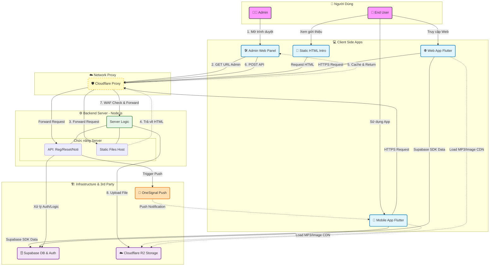

# **Karaoke Plus**

# 1. Giới thiệu:
**Karaoke Plus** là một app karaoke để người dùng ca hát giải trí, ở đây người dùng có thể
hát và chia sẻ những đoạn cover 'đỉnh cao' để mọi người
cùng nhau thưởng thức.

# 2. Yêu cầu môi trường:
Để chạy dự án này, máy tính của bạn BẮT BUỘC phải có:
1. **Flutter SDK:** Phiên bản Stable mới nhất (>= 3.24.x).
    - Kiểm tra bằng lệnh: `flutter --version`
2. **Java JDK:** Phiên bản 17 (Bắt buộc cho Android Gradle Plugin mới).
    - Kiểm tra bằng lệnh: `java -version`
    - Nếu chưa có, hãy cài đặt OpenJDK 17.

# 3. Cách chạy dự án:

1. Clone Repository:

        git clone https://github.com/Phap625/App-karaoke.git

2. Tải các gói phụ thuộc:
    
        flutter pub get

3. Tạo biến môi trường:
    #### Windows:
        copy .env.example .env

    #### Mac/Linux:
        cp .env.example .env
    ### và điền giá trị vào các Key trong .env

4. Chọn máy ảo và chạy:

        flutter run

5. Fix lỗi(nếu có) bằng lệnh:

        https://gemini.google.com

# 4. Sơ đồ hoạt động hệ thống:

